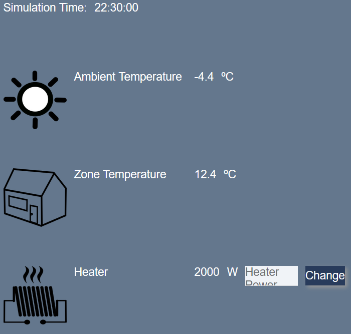
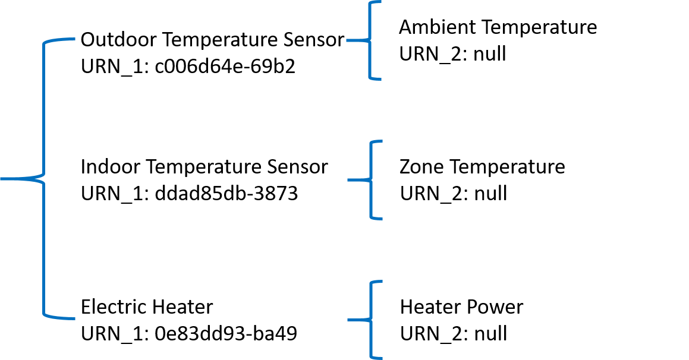
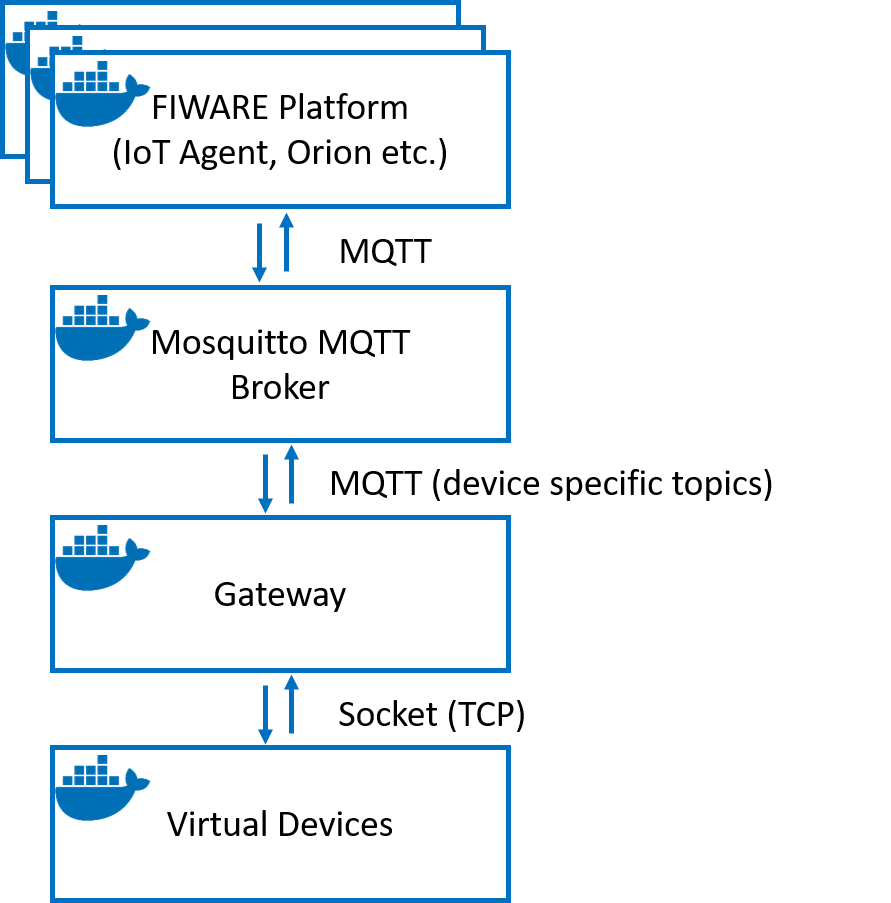
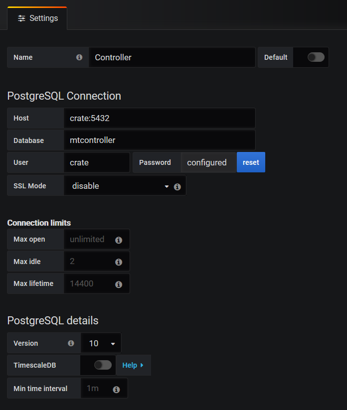
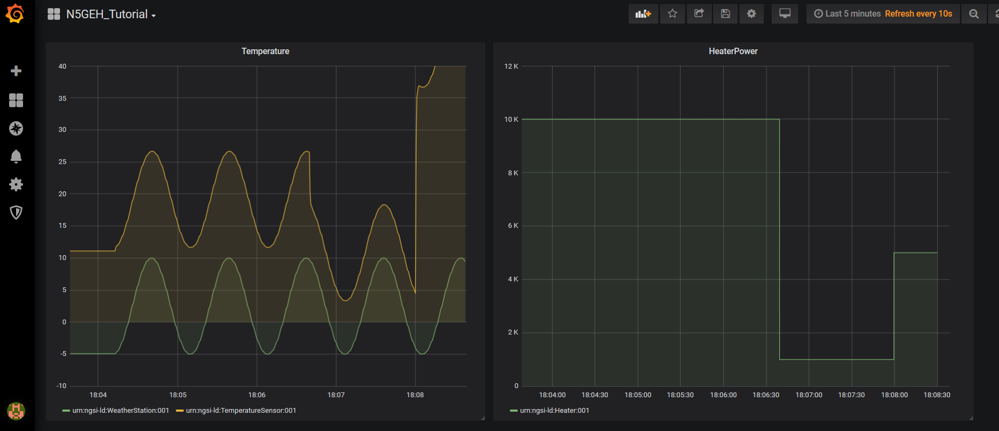
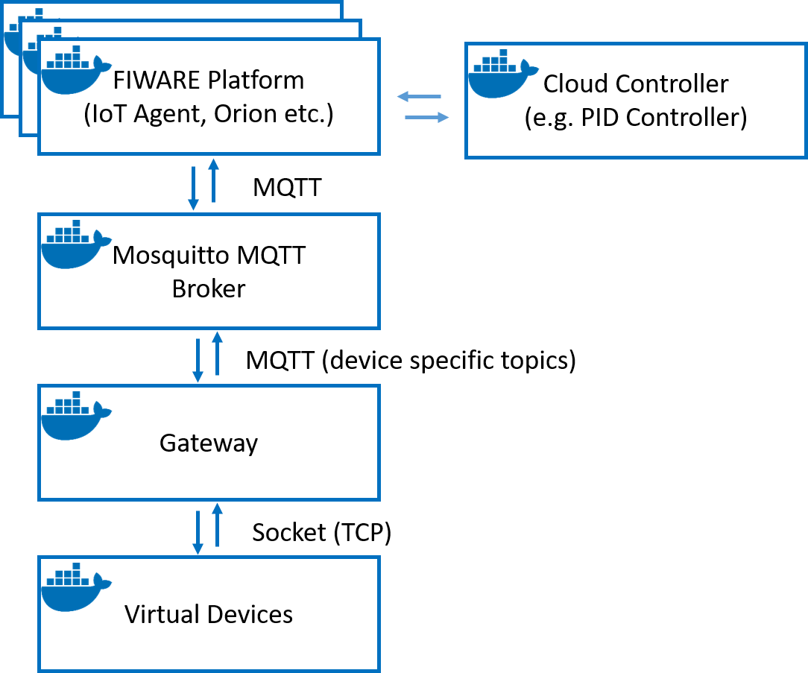
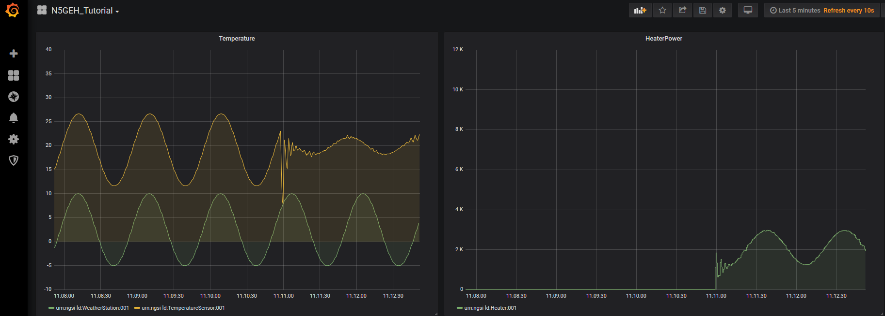

# N5GEH Tutorial

This is a tutorial of N5GEH project. This tutorial is intended to provide a brief overview
on how devices (sensors/actuators) can be connected to the FIWARE IoT platform. This
tutorial uses a simple scenario to work you through the whole procedure of 
connecting devices to FIWARE platform. Besides, this tutorial also shows the usage of 
two basic services, i.e. live monitoring and cloud controller.

Before you start, please make sure that the following prerequisites are fulfilled.

## Prerequisites

- Docker

    [Docker](https://www.docker.com/) has to be installed on your local machine.

- N5GEH FIWARE platform

    You must have access to a [N5GEH FIWARE platform](https://github.com/N5GEH/n5geh.platform), which can be hosted either on your local machine or somewhere else. For these examples, it is recommended that you host a platform on your local machine.
  This tutorial is compatible with both NGSI-V2 and NGSI-LD platforms.
  > **NOTE**: if you are using our configuration of NGSI-LD platform from [here](https://github.com/N5GEH/n5geh.platform/tree/master/ld), please check and adapt the settings in `docker-compose.yml` of this tutorials, i.e., use `MQTT_PORT=1884`

- Postman

    Postman is a testing framework for REST APIs. The tool can be downloaded from [www.getpostman.com](www.getpostman.com)

## Step by step

To start the tutorial, please first clone the repository and then run the bash script as below:

```bash
git clone https://github.com/N5GEH/n5geh.tutorials.from_sensor_to_application.git
cd n5geh.tutorials.from_sensor_to_application
./services create
```

> **NOTE:** If the service is not executable, execute `chmod 744 services` in command line to change the right

This script will build all the images required by this tutorial.

### Step 1: Deploy Devices

The first step of building a smart systems is to deploy the devices, e.g. 
sensors and actuators. In this tutorial, we consider a simple scenario as shown 
in Figure 1.


*Figure 1: A simple house with an electric heater*

Under this scenario, there are three devices:
- Outdoor temperature sensor in the weather station
- Indoor temperature sensor in the house
- Electric heater

This scenario is simulated in a container. Use the following
command to start the simulation.

> **NOTE:** if you are not using docker desktop (e.g. docker is directly installed on linx OS), please change all `host.docker.internal` in all `docker-compose.yml` files to `172.17.0.1`. Otherwise there will be a networking error.

```bash
docker compose create
docker start virtual_device
```

> **NOTE:** if you are using LD platform stack, please check the port in ``docker-compose.yml`` carefully. 

The simulation can be monitored live on the [web GUI](http://localhost:8001/) as shown 
in Figure 2.



*Figure 2: Monitor the simulation on Web GUI*

> **NOTE:** the virtual devices are now only deployed in a container
but can still not communicate with the FIWARE platform. The 
connection between them will be established in the following steps.

### Step 2: Provision the Devices on N5GEH FIWARE Platform

In this step, we will provision the devices on FIWARE platform. Each device has to be provisioned, so that the platform can ever know what can be measured by the sensor and what commands can be sent to the actuators. The Prosioning is done by sending HTTP request to the [IoT Agent](https://iotagent-node-lib.readthedocs.io/en/latest/api.html) API. For this tutorial, it is not requied to understand the logics behind these HTTP requests. Therefore, we prepare a postman collection to collect the necessary HTTP requests.

[](https://app.getpostman.com/run-collection/19622830-7799ea6a-24d1-4204-85f1-1f930d011eaf?action=collection%2Ffork&source=rip_markdown&collection-url=entityId%3D19622830-7799ea6a-24d1-4204-85f1-1f930d011eaf%26entityType%3Dcollection%26workspaceId%3D2c722372-0f8e-4b7b-9661-17f17ec8c7fb)

> **NOTE**: please use the requests in the folder `v2` or `ld`, depending on the platform, i.e. NGSI-V2 or NGSI-LD, that you are using

Please complete the following steps using the corresponding postman requests:
1. Create Entities
2. Create Service Group
3. Create Devices
4. Create MQTT Command Connection
5. Create Timeseries Subscription

After that, the **provisioning** of the devices and data persistence is done. You can check the created elements via:

6. Check Service Group
7. Check Devices
8. Check Entities
9. Check Subscription


### Step 3: Connect the Devices to the Platform

Now we have created the entities of the devices on FIWARE platform.
The data transmission between the entities and the virtual devices 
still need to be established. FIWARE is designed to communicate with devices via HTTP or MQTT and with its own rules.
For example, for using HTTP some parameters are mandatory, and for using MQTT the 
topics are device specific. In this tutorial, we use MQTT as the communication protocol.

The devices in this tutorial runs in a simulation program. Therefore, with just some additional
program code, it is rather simple to let them send/receive data directly via MQTT.
However, in the real practice the devices must be connected to a network via a 
communications technology, e.g. TCP, NB-IoT, LoRaWAN etc. In order to emulate this 
data transmission process, the virtual devices use socket, i.e. TCP, to
transmit data. The transmitted data follows the JSON format:

```JSON
{
  "URN_1/URN_2": "value", 
  "URN_1/URN_2": "value"
}
```

The URNs represent the identifier of devices (URN_1) and their
attributes/commands (URN_2). In this tutorial there are three devices, and each
device has only one attribute or one command. Their URNs are set as follows:



Since the data flow of socket communication is not supported by FIWARE
(just like many other communications technology), a gateway has to be deployed as a middleware
between socket and MQTT protocol. The gateway will map the URNs with 
the device specific MQTT topics. In this way, measurements will be first sent to the
gateway via socket, and the gateway forwards the received data with proper MQTT topics to
the MQTT Broker. And then the measurements can reach the FIWARE platform.
The data flows of commands are exactly opposite. Figure X gives a brief view of the network architecture of this tutorial.



*Figure 3: The network architecture of this tutorial*

As next step, we need to load the information of FIWARE devices to the gateway. This information
can be queried via HTTP request from FIWARE platform (acquired from SENSE APP). The corresponding
request is given in the postman collections, `Check Devices`. Copy and past the request results to the file
`devices.json`, so that the gateway can know the corresponding topic of each device.

And then, we need to set up the mapping between FIWARE devices and the URNs 
of virtual devices. A template of the mapping is given by 
`dummy_mapping.json`. Please fill in this file and save it as `mapping.json`.
Then the gateway will know which URNs correspond to which device and which
attribute/command. The correct MQTT topics will be generated automatically.
Here is an example of `mapping.json`:

```JSON
{
    "c006d64e-69b2": {
        "device_id": "device:001",
        "entity_name": "urn:ngsi-ld:WeatherStation:001",
        "attribute/command": {
            "": "temperature"
        }
    },
    "ddad85db-3873": {
        "device_id": "device:002",
        "entity_name": "urn:ngsi-ld:TemperatureSensor:001",
        "attribute/command": {
            "": "temperature"
        }
    },
    "0e83dd93-ba49": {
        "device_id": "device:003",
        "entity_name": "urn:ngsi-ld:Heater:001",
        "attribute/command": {
            "": "heaterPower"
        }
    }
}
```

> **NOTE:** `"": "temperature"` means that the URN of the attribute `temperature`
> is empty.


The gateway also runs in a container. After setting up the information of
devices and the mapping file, the gateway can be started with the
following command:

```bash
docker start gateway
```

In oder to check the connection, we will try to change the heater power by sending command
to FIWARE platform. The corresponding request is `Send Command` in the postman collection.
The heater power can be changed in the payload ("Body") of the request. If the connection
is successfully established, you will see the change of heater power on the [web GUI](http://localhost:8001/)
of the simulation.

### Step 4: Monitoring Time Series Data

In the previous steps, the platform has already received a lot of data.
This data has been persistently stored as time series, which is also 
available for querying and can be used for various analyses. 
In the Postman collection, you will find three requests that query the 
time series data for each entity individually. Feel free to try them out.

Besides, there is also a live monitoring service via Grafana. The users
can view the value of entity attributes on a dashboard. To start the service,
please first log in to the [Grafana Dashboard](http://localhost:3000) with the 
default username `admin` and default password `admin`.

Then we need to connect to the CrateDB. Create a `PostgreSQL` datasource
[here](http://localhost:3000/datasources) and use the following setups.

- **Name:** Controller (an arbitrary name)
- **Host:** crate:5432 (crate is the host name of CrateDB inside the docker network, 5432 is an internal open port for SQL query)
- **Database:** mtcontroller (mt + fiware service name)
- **User:** crate
- **SSL Mode:** disable



*Figure 4: Setups of Grafana Datasource*

As next step, the time-series data of each device can be queried and displayed in a 
dashboard. For simplicity, you can load an existing template, 
`Grafana_Template.json`, [here](http://localhost:3000/dashboard/import).

> **NOTE**: If you get a field type error for `heaterpower_info`, you can downgrade the Grafana version. Change this line [here](https://github.com/N5GEH/n5geh.platform/blob/b9a6a7d55dd0d59d7dcbb71052dc717720822d0e/docker-compose.yml#L103) to `image: grafana/grafana:9.0.1`, and then use `docker compose up -d` to restart the platform.

Now you should be able to monitor the live change of the attribute's values just as 
shown in Figure 5. Feel free to change the hearting power and then view the
simulation results on the dashboard.



*Figure 5: Setups of Grafana Datasource*

### Step 5: Controller Services

Beside the existing monitoring service, it is possible to deploy 
various custom applications to FIWARE platform, for example a cloud
controller. Unlike local controller, a cloud controller does not directly connect
to sensors or actuators, but reads measurements and send commands via the platform.
Figure 6 illustrates the architecture of this concept. 



*Figure 6: FIWARE platform with cloud controller*

In N5GEH project, a 
[PID controller](https://github.com/N5GEH/n5geh.services.controller/tree/master/PIDControl)
is already developed for FIWARE platform, which can be deployed to any
single-input-single-output (SISO) system. The devices in this tutorial
construct a typical SISO-System, in which the heater power is the
control variable and the indoor temperature is the process variable.
As next step, we will deploy the PID controller to this system.

The PID controller need to know, where it can find the FIWARE platform and which FIWARE devices 
should be observed or controlled. The information about the FIWARE platform is given by
the environment variables in `n5geh.services.controller/PIDControl/docker-compose.yml`:


- **CB_URL**=http://host.docker.internal:1026
- **FIWARE_SERVICE**=controller
- **FIWARE_SERVICE_PATH**=/

- **SAMPLING_TIME**=1
- **CONTROLLER_ENTITY_ID**=urn:ngsi-ld:PIDController:001
- **CONTROLLER_ENTITY_TYPE**=PIDController

And the information of FIWARE devices can be configured in `n5geh.services.controller/PIDControl/config`.
Normally, these configuration files have to be set properly and then passed to the controller. However,
the default configurations are already suitable for this tutorial. For more details, please view
[here](https://github.com/N5GEH/n5geh.services.controller/tree/master/PIDControl)


PID controller can be started with the following command:

```bash
cd n5geh.services.controller/PIDControl
docker compose up -d
```

Now you can see the effect of the PID controller in [Grafana dashboard](http://localhost:3000).



*Figure 7: The effect of the PID controller*

It can be seen that, the PID controller does not work perfectly yet. You can tune the
PID controller on a [GUI control panel](http://localhost:80/)

## Authors and acknowledgment
- **Junsong Du**

## Further project information

<a href="https://n5geh.de/"> </a>

## Acknowledgments

We gratefully acknowledge the financial support of the Federal Ministry <br /> 
for Economic Affairs and Climate Action (BMWK), promotional references 
03EN1030B and 03ET1561B.

<a href="https://www.bmwi.de/Navigation/EN/Home/home.html">  </a>
